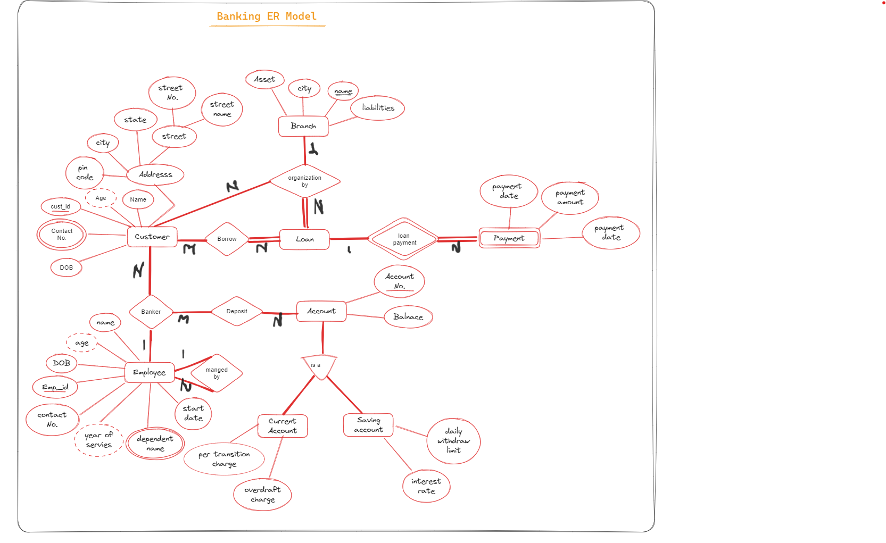

# How to  Create Banking Database #
- Step to make ER Dragram
  1. identify entity set
  2. identify attribute their type
  3. identify  Relation & contraints
    - Mapping
    - participation
 
* Required of database

  
  1.banking system (Braches , B_name)   
  2.Bank ->customer   
  3.customer -> saving Ac / current & take laon

  
  
## _Create ER banking Model_ ##

